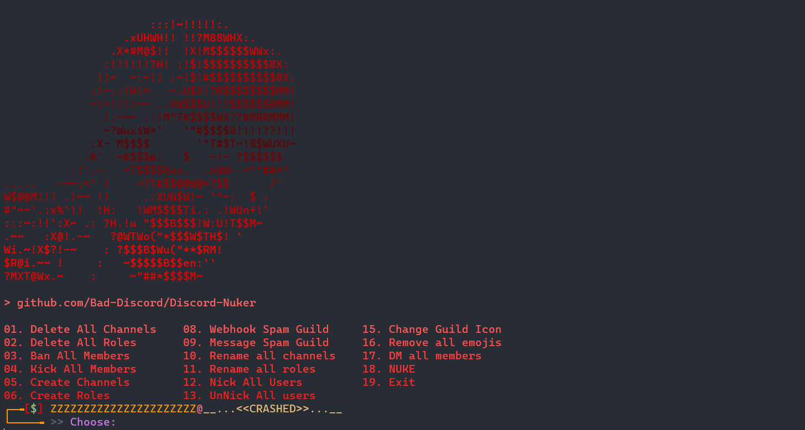

# Bad Discord Nuker


<p align="center">
 
 
 
</p>

<p align="center">
[<a href="https://github.com/Bad-Discord/Discord-Nuker/#installation"> How to install</a> ] - 
[<a href="https://github.com/Bad-Discord/Discord-Nuker/#Screenshots"> Screenshots</a> ]

</p>

### *Features :*
> - [x] *Spam in all channels*
> - [x] *Delete all Role*
> - [x] *Rename all Role*
> - [x] *Delete all Channels*
> - [x] *Rename all Channels*
> - [x] *Delete all Emoji*
> - [x] *Create many Channel*
> - [x] *Ban all*
> - [x] *Spam with Webhook*
> - [x] *Spam with The Bot*
> - [x] *Dm all*
> - [x] *Nickname All*
> - [x] *Update server Avatar*
> - [x] *Update server Name*
> - [x] *Security Bypasser*
> - [x] *Proxy Support*
> - [x] *Session Support*
## Installation

- Make sure you have python installed on your pc. 
- [Python3.7.12](https://www.python.org/downloads/release/python-3712/) or higher (except [Python3.12.0](https://www.python.org/downloads/release/python-3120/) it's trash)


### Windows: 
- Click on the "Code" Button on this repo and download ZIP
- Extract zip
- Open a terminal and paste this code on it:
```bash
pip install -r requirements.txt; python main.python
``` 
- **Or** just open the `main.py` and let it install its requirements


### Termux
- Here is the one line command for Installation:
```shell
pkg update -y && pkg upgrade -y && pkg install python git && git clone https://github.com/Bad-Discord/Discord-Nuker && cd Discord-Nuker && pip install -r requirements.txt && python main.py
```
- Just copy and paste it in your Termux's shell


## Usage

### Normal Usage
- Use `python main.py` or run it manually by double click

### Using Sessions

 - Create a [Session](https://github.com/Bad-Discord/Discord-Nuker/#sessions) file and then run `python main.py <your session>`

```bash
python main.py session.json
```


## Sessions
### What is Sessions?
if you're Too lazy to copy and paste the same token every time; create a Session file insted and run the code with the session file. 

- Create a `.json` file in root folder or somewhere and then paste the text bellow on it 

```json
{
    "Token": "You're Token",
    "SpamTexts": ["Some Texts", "For Spam"],
    "SpamAmount": 50,
    "ServerName": "Logique Nuked this Guild Bruh!",
    "SpamInviteLink": "discord.gg/cool-people"
}
```

`Token`: Your nuker bot's token

`Spam Texts`: Some Texts for sending in spam messages

`SpamAmount`: The number of channels and roles to be created and the number of messages to be sent

`ServerName`: A name to change the main name of the server

`SpamInviteLink`: Your server invite link that you want to spam it

## 📸 Screenshots



## ⚠ Disclaimer

This script is educational and fully coded by M. logique aka @1ogi in discord
if you choose to abuse this tool it's are your fault and M. logique will not accept anything about you're mistake